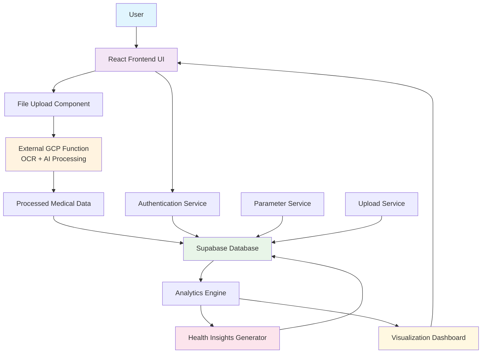

# LabFlow Analyzer - Correct Architecture

## 🏗️ System Architecture Overview

## 📋 Detailed Component Breakdown

### 1. **Frontend Layer (React + TypeScript)**
- **User Interface**: React components with Radix UI
- **Authentication**: Supabase Auth integration
- **File Upload**: PDF upload with progress tracking
- **Analytics Dashboard**: Medical data visualization
- **Health Insights**: AI-generated recommendations

### 2. **Processing Layer (External Services)**
- **GCP Function**: `https://asia-south1-healthpay-434611.cloudfunctions.net/swasthx`
- **OCR Processing**: Extracts text from PDF reports
- **AI Analysis**: Processes medical data and generates structured results
- **Data Validation**: Ensures medical parameter accuracy

### 3. **Data Layer (Supabase)**
- **Authentication Database**: User management
- **Reports Table**: Stored medical reports metadata
- **Test Results Table**: Individual test values
- **Parameters Table**: Medical parameter definitions
- **Reference Ranges Table**: Normal value ranges
- **Parameter Insights Table**: Medical recommendations

### 4. **Business Logic Layer**
- **Upload Service**: Handles file processing and storage
- **Parameter Service**: Manages medical parameter mapping
- **Analytics Service**: Generates insights and trends
- **Health Insights Engine**: Provides medical recommendations

## 🔄 Data Flow

1. **User Upload**: PDF medical report → Frontend
2. **Authentication**: User verification → Supabase Auth
3. **Processing**: PDF → GCP Function → OCR + AI Analysis
4. **Storage**: Processed data → Supabase Database
5. **Analysis**: Data → Analytics Engine → Insights
6. **Visualization**: Insights → Dashboard → User

## 🛠️ Technology Stack

### Frontend
- React 18.3.1
- TypeScript 5.5.3
- Vite 5.4.1
- Tailwind CSS 3.4.11
- Radix UI Components
- Recharts (Data Visualization)

### Backend & Database
- Supabase (Database + Auth)
- PostgreSQL (via Supabase)
- GCP Cloud Functions (External Processing)

### External Services
- Google Cloud Platform Functions
- OCR + AI Processing Service

## 📊 Medical Analysis Capabilities

### Test Categories
- **Complete Blood Count (CBC)**
- **Liver Function Tests (LFT)**
- **Lipid Profile**
- **Diabetes Markers**

### Features
- Real-time data processing
- Trend analysis and visualization
- Health insights and recommendations
- Parameter normalization
- Reference range comparisons
- Medical parameter mapping

## 🔐 Security & Authentication

- Supabase Authentication
- Protected routes
- User session management
- Secure file upload
- Data encryption at rest

## 📈 Scalability Considerations

- Microservices architecture
- External processing for heavy computation
- Database indexing for performance
- Caching with React Query
- Responsive design for all devices

